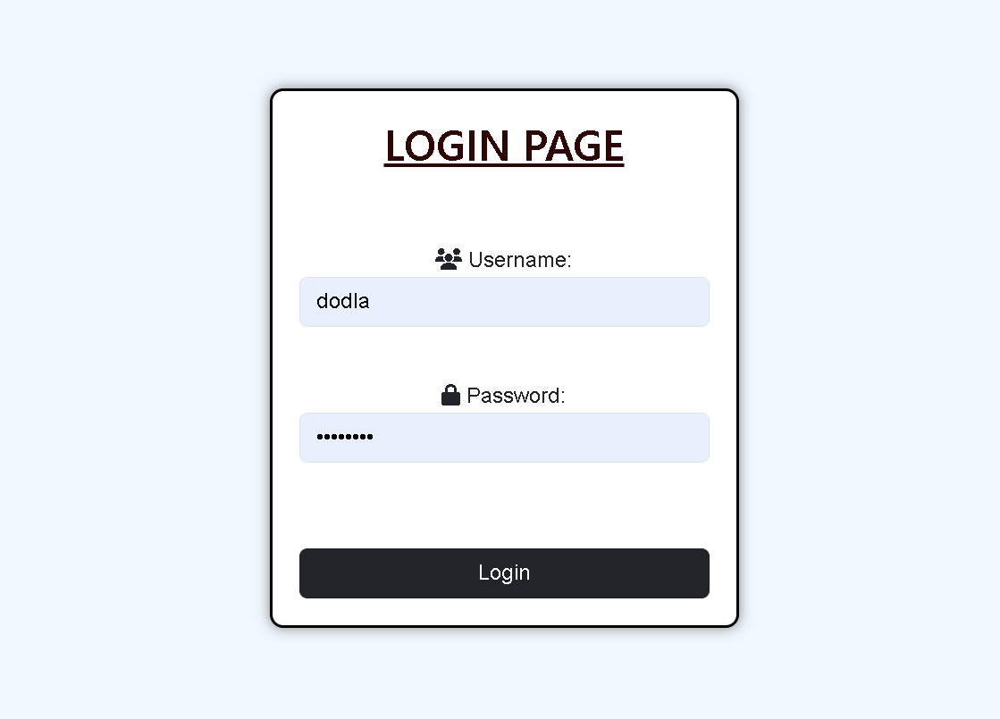
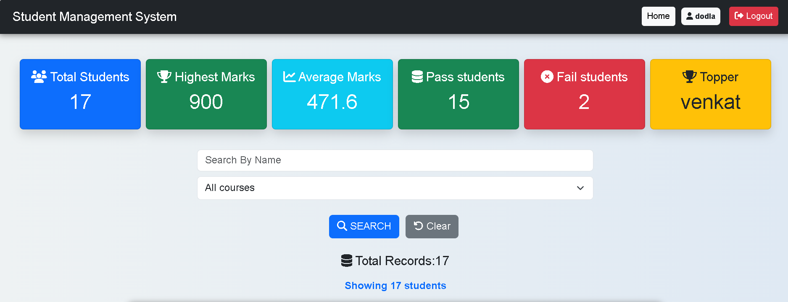
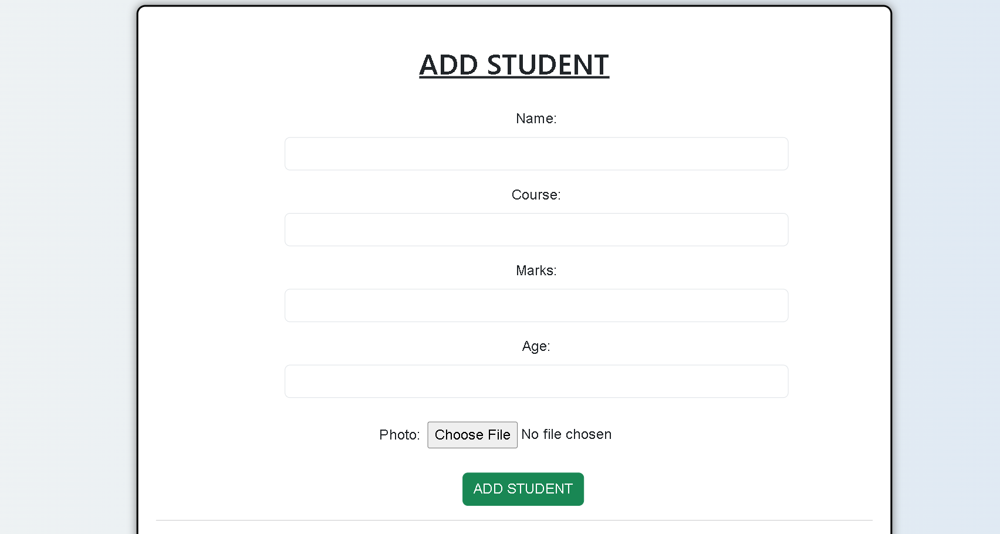
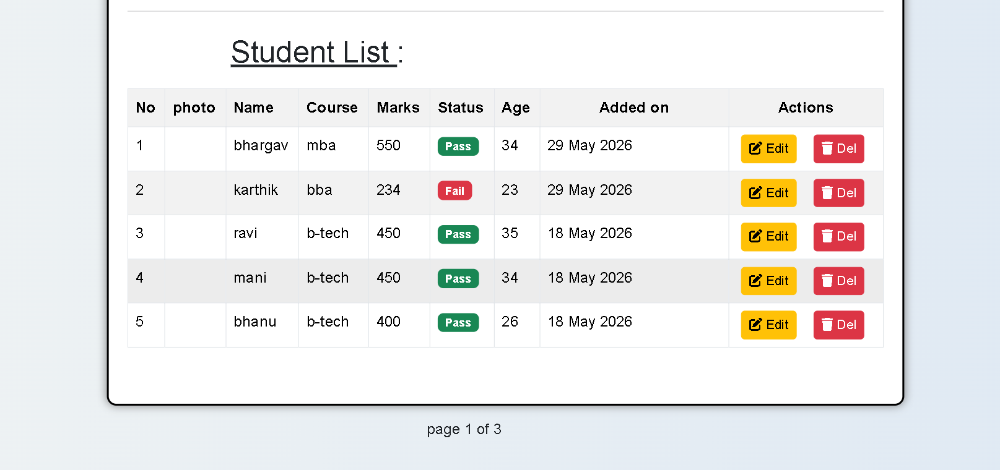
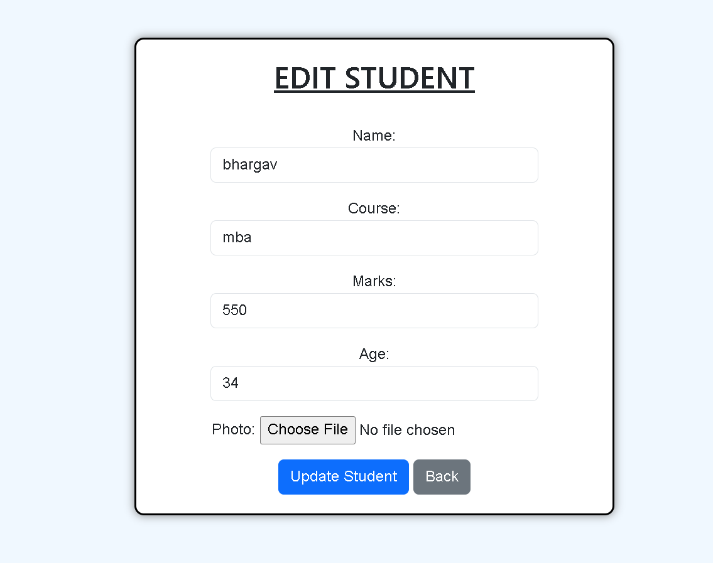

# Student Management System

## Project Overview

Student Management System is a Django-based web application designed to manage student records efficiently. The system allows administrators to add, view, update, search, and delete student information through a user-friendly interface.

## Screenshots

### Login Page


### Dashboard


### Add Student Page


### student list


### Edit Student Page


## Features

* Add Student Records
* View Student Details
* Update Student Information
* Delete Student Records
* User Authentication & Login System
* CRUD Operations
* Search Functionality
* Pagination
* Form Validation
* Photo Upload
* Dashboard for Student Management

## Technologies Used

* Python
* Django
* SQL (SQLite)
* HTML
* CSS
* Bootstrap
* Git & GitHub

## Project Structure

* Django Framework
* Django ORM
* Authentication System
* Student Database Management
* Responsive User Interface

## Installation

1. Clone the repository

```bash
git clone <repository-url>
```

2. Navigate to project folder

```bash
cd student-management-system
```

3. Install dependencies

```bash
pip install -r requirements.txt
```

4. Apply migrations

```bash
python manage.py migrate
```

5. Run the server

```bash
python manage.py runserver
```

6. Open browser

```text
http://127.0.0.1:8000/
```

## Learning Outcomes

* Django Models
* Django Forms
* Django Authentication
* Django ORM
* CRUD Operations
* Pagination
* Search Functionality
* Database Integration
* Git & GitHub Workflow

## Author

Dodla Teja Narasimha
